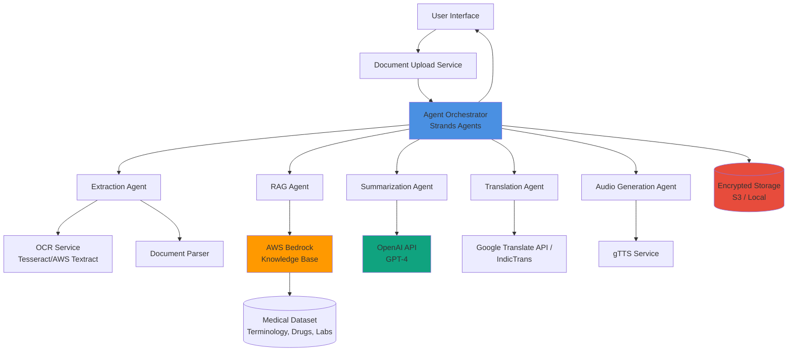
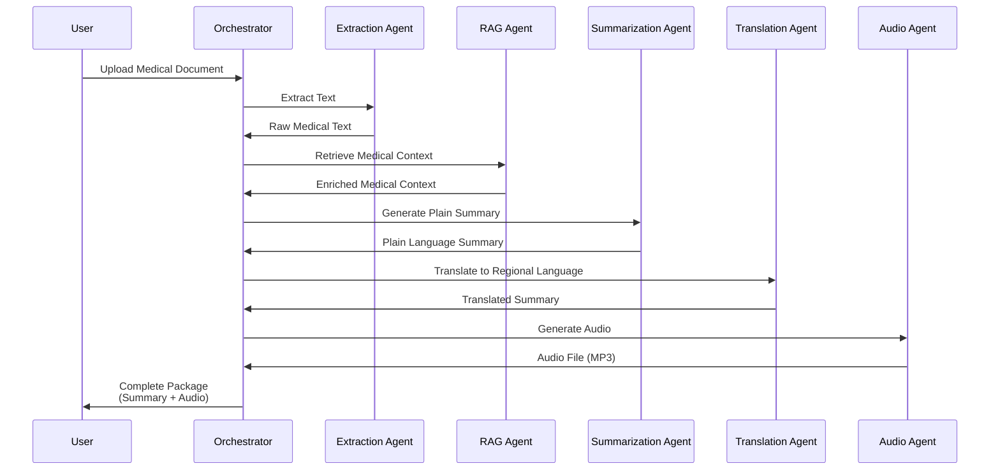

# Design Document: Fabino Medical Decoder

## Overview

Fabino Medical Decoder is a multi-agent AI system that transforms complex medical documents into accessible, multilingual audio-enabled summaries for India's underserved patient population. The system orchestrates a pipeline of specialized agents to handle document processing, medical content extraction, plain-language summarization, translation, and audio generation.

The architecture follows a microservices pattern with agent-based orchestration using Strands Agents. Each processing stage is handled by a dedicated agent that can operate independently while maintaining data flow through the pipeline. The system prioritizes medical accuracy, data security, and accessibility for users with varying literacy levels.

Key design principles:
- **Medical Accuracy**: RAG-based retrieval ensures medical terminology is correctly interpreted
- **Accessibility First**: Audio output and simple language make health information accessible to all literacy levels
- **Privacy by Design**: End-to-end encryption and automatic data deletion protect patient information
- **Fault Tolerance**: Graceful degradation and retry logic ensure reliable operation
- **Scalability**: Agent-based architecture supports concurrent processing of multiple documents

## Architecture

### System Architecture Diagram



### Agent Pipeline Flow



### Technology Stack

**Agent Orchestration**:
- Strands Agents: Multi-agent workflow orchestration
- Python 3.11+: Runtime environment

**Document Processing**:
- PyPDF2 / pdfplumber: PDF text extraction
- Tesseract OCR / AWS Textract: Image-to-text conversion
- Pillow: Image preprocessing

**AI/ML Services**:
- AWS Bedrock Knowledge Base: RAG engine for medical context retrieval
- OpenAI GPT-4: Plain-language summarization
- Google Translate API / IndicTrans: Multilingual translation
- gTTS (Google Text-to-Speech): Audio generation

**Storage & Security**:
- AWS S3 / Local filesystem: Encrypted document storage
- AES-256: Data-at-rest encryption
- TLS 1.3: Data-in-transit encryption

**API Framework**:
- FastAPI: REST API endpoints
- Pydantic: Data validation and serialization

**Frontend**:
- React: User interface
- Tailwind CSS: Responsive styling
- Axios: API communication

## Components and Interfaces

### 1. Document Upload Service

**Responsibility**: Handle file uploads, validate formats, and perform initial preprocessing.

**Interface**:
```python
class DocumentUploadService:
    def upload_document(
        self, 
        file: UploadFile, 
        user_id: str
    ) -> UploadResult:
        """
        Upload and validate a medical document.
        
        Args:
            file: Uploaded file object
            user_id: Unique user identifier
            
        Returns:
            UploadResult with document_id and validation status
            
        Raises:
            InvalidFormatError: If file format is not supported
            FileSizeError: If file exceeds 10MB limit
        """
        pass
    
    def validate_file(self, file: UploadFile) -> ValidationResult:
        """Validate file format and size."""
        pass
```

**Supported Formats**: PDF, JPG, PNG, TXT
**Size Limit**: 10MB
**Validation**: MIME type checking, file size verification

### 2. Extraction Agent

**Responsibility**: Extract text content from uploaded documents using appropriate extraction method based on file type.

**Interface**:
```python
class ExtractionAgent:
    def extract_text(
        self, 
        document_path: str, 
        document_type: DocumentType
    ) -> ExtractionResult:
        """
        Extract text from document based on type.
        
        Args:
            document_path: Path to uploaded document
            document_type: PDF, IMAGE, or TEXT
            
        Returns:
            ExtractionResult with extracted text and confidence score
        """
        pass
    
    def extract_from_pdf(self, pdf_path: str) -> str:
        """Extract text from PDF using pdfplumber."""
        pass
    
    def extract_from_image(self, image_path: str) -> OCRResult:
        """Extract text from image using OCR with confidence scores."""
        pass
    
    def preprocess_image(self, image_path: str) -> str:
        """Enhance image quality before OCR."""
        pass
```

**OCR Strategy**:
- Use Tesseract for local processing
- Fall back to AWS Textract for low-confidence results
- Image preprocessing: grayscale conversion, contrast enhancement, noise reduction

### 3. RAG Agent

**Responsibility**: Retrieve relevant medical context from knowledge base to enrich document understanding.

**Interface**:
```python
class RAGAgent:
    def retrieve_medical_context(
        self, 
        medical_text: str, 
        context_types: List[ContextType]
    ) -> MedicalContext:
        """
        Retrieve medical context from AWS Bedrock Knowledge Base.
        
        Args:
            medical_text: Extracted medical document text
            context_types: Types of context needed (TERMINOLOGY, DRUGS, LAB_TESTS)
            
        Returns:
            MedicalContext with retrieved information
        """
        pass
    
    def query_knowledge_base(
        self, 
        query: str, 
        context_type: ContextType
    ) -> List[ContextChunk]:
        """Query specific knowledge base partition."""
        pass
    
    def extract_medical_entities(self, text: str) -> List[MedicalEntity]:
        """Identify medical terms, drugs, and test names in text."""
        pass
```

**Knowledge Base Structure**:
- Medical Terminology Dataset: Common medical terms with plain-language definitions
- Drug Information Dataset: Medication names, purposes, dosages, side effects
- Lab Test Reference Dataset: Test names, normal ranges, result interpretations
- Synthetic Medical Texts: Example medical documents for context

**Retrieval Strategy**:
- Entity extraction to identify medical terms
- Semantic search using embeddings
- Top-k retrieval (k=5) for each entity
- Context aggregation and deduplication

### 4. Summarization Agent

**Responsibility**: Generate plain-language summaries using OpenAI GPT-4 with retrieved medical context.

**Interface**:
```python
class SummarizationAgent:
    def generate_summary(
        self, 
        medical_text: str, 
        medical_context: MedicalContext
    ) -> PlainLanguageSummary:
        """
        Generate plain-language summary from medical text.
        
        Args:
            medical_text: Original extracted text
            medical_context: Retrieved medical context from RAG
            
        Returns:
            PlainLanguageSummary organized by sections
        """
        pass
    
    def structure_summary(
        self, 
        raw_summary: str
    ) -> StructuredSummary:
        """Organize summary into sections (diagnosis, medications, etc.)."""
        pass
    
    def simplify_language(
        self, 
        text: str, 
        target_grade_level: int = 6
    ) -> str:
        """Ensure text is at target reading level."""
        pass
```

**Summarization Prompt Template**:
```
You are a medical translator helping patients understand their health documents.

Original Medical Text:
{medical_text}

Medical Context:
{medical_context}

Generate a plain-language summary that:
1. Explains all medical terms in simple language
2. Organizes information into clear sections
3. Emphasizes critical warnings or instructions
4. Uses a 6th-grade reading level
5. Maintains medical accuracy

Structure the summary with these sections:
- What This Document Is About
- Your Diagnosis (if applicable)
- Your Medications (if applicable)
- Test Results (if applicable)
- What You Need To Do
- Important Warnings
```

### 5. Translation Agent

**Responsibility**: Translate plain-language summaries into regional languages while preserving medical accuracy.

**Interface**:
```python
class TranslationAgent:
    def translate_summary(
        self, 
        summary: PlainLanguageSummary, 
        target_language: Language
    ) -> TranslatedSummary:
        """
        Translate summary to target regional language.
        
        Args:
            summary: Plain-language summary in English
            target_language: Hindi, Tamil, or English
            
        Returns:
            TranslatedSummary with language metadata
            
        Raises:
            TranslationError: If translation fails after retry
        """
        pass
    
    def translate_with_retry(
        self, 
        text: str, 
        target_language: Language
    ) -> str:
        """Translate with automatic retry on failure."""
        pass
    
    def validate_translation(
        self, 
        original: str, 
        translated: str
    ) -> bool:
        """Verify translation quality and completeness."""
        pass
```

**Translation Strategy**:
- Primary: Google Translate API for broad language support
- Alternative: IndicTrans for better Indian language accuracy
- Retry logic: One automatic retry on failure
- Fallback: Return English summary with error notification

**Supported Languages**:
- Hindi (hi)
- Tamil (ta)
- English (en) - default

### 6. Audio Generation Agent

**Responsibility**: Convert translated text to natural-sounding audio using gTTS.

**Interface**:
```python
class AudioGenerationAgent:
    def generate_audio(
        self, 
        text: str, 
        language: Language
    ) -> AudioFile:
        """
        Generate audio from translated text.
        
        Args:
            text: Translated summary text
            language: Target language for audio
            
        Returns:
            AudioFile with MP3 data and metadata
            
        Raises:
            AudioGenerationError: If audio generation fails
        """
        pass
    
    def optimize_audio(self, audio_data: bytes) -> bytes:
        """Compress audio to meet 5MB size limit."""
        pass
    
    def chunk_long_text(self, text: str, max_length: int = 500) -> List[str]:
        """Split long text into manageable chunks for audio generation."""
        pass
```

**Audio Configuration**:
- Format: MP3
- Bitrate: 64 kbps (optimized for size)
- Max size: 5MB per summary
- Language-specific voices via gTTS

### 7. Agent Orchestrator

**Responsibility**: Coordinate the multi-agent pipeline, manage state, handle errors, and track progress.

**Interface**:
```python
class AgentOrchestrator:
    def process_document(
        self, 
        document_id: str, 
        user_preferences: UserPreferences
    ) -> ProcessingResult:
        """
        Orchestrate complete document processing pipeline.
        
        Args:
            document_id: Unique document identifier
            user_preferences: Language and other user settings
            
        Returns:
            ProcessingResult with all outputs and status
        """
        pass
    
    def execute_pipeline(
        self, 
        document_id: str
    ) -> PipelineState:
        """Execute agents in sequence with error handling."""
        pass
    
    def handle_agent_failure(
        self, 
        agent_name: str, 
        error: Exception
    ) -> RecoveryAction:
        """Determine recovery action for agent failures."""
        pass
    
    def track_progress(
        self, 
        document_id: str, 
        stage: PipelineStage
    ) -> None:
        """Update processing progress for user feedback."""
        pass
```

**Pipeline Stages**:
1. UPLOAD_COMPLETE
2. EXTRACTION_IN_PROGRESS
3. EXTRACTION_COMPLETE
4. RAG_RETRIEVAL_IN_PROGRESS
5. RAG_RETRIEVAL_COMPLETE
6. SUMMARIZATION_IN_PROGRESS
7. SUMMARIZATION_COMPLETE
8. TRANSLATION_IN_PROGRESS
9. TRANSLATION_COMPLETE
10. AUDIO_GENERATION_IN_PROGRESS
11. AUDIO_GENERATION_COMPLETE
12. PROCESSING_COMPLETE

**Error Handling Strategy**:
- Timeout: 60 seconds per agent
- Retry: One automatic retry on failure
- Logging: Detailed error logs for debugging
- User Notification: User-friendly error messages
- Graceful Degradation: Provide partial results when possible

### 8. Storage Service

**Responsibility**: Securely store and manage documents, summaries, and audio files with encryption and automatic deletion.

**Interface**:
```python
class StorageService:
    def store_document(
        self, 
        document_id: str, 
        data: bytes, 
        metadata: DocumentMetadata
    ) -> StorageResult:
        """Store encrypted document with metadata."""
        pass
    
    def retrieve_document(self, document_id: str) -> bytes:
        """Retrieve and decrypt document."""
        pass
    
    def schedule_deletion(
        self, 
        document_id: str, 
        hours: int = 24
    ) -> None:
        """Schedule automatic deletion after specified hours."""
        pass
    
    def delete_all_user_data(self, user_id: str) -> DeletionResult:
        """Permanently delete all data for a user."""
        pass
```

**Security Features**:
- Encryption at rest: AES-256
- Encryption in transit: TLS 1.3
- Automatic deletion: 24 hours after processing
- User-initiated deletion: Immediate permanent deletion
- No third-party data sharing

## Data Models

### Document Models

```python
from enum import Enum
from typing import List, Optional
from pydantic import BaseModel, Field
from datetime import datetime

class DocumentType(str, Enum):
    PDF = "pdf"
    IMAGE = "image"
    TEXT = "text"

class Language(str, Enum):
    ENGLISH = "en"
    HINDI = "hi"
    TAMIL = "ta"

class UploadFile(BaseModel):
    filename: str
    content_type: str
    size: int
    data: bytes

class UploadResult(BaseModel):
    document_id: str
    status: str
    message: str
    timestamp: datetime

class ValidationResult(BaseModel):
    is_valid: bool
    errors: List[str] = []
    warnings: List[str] = []
```

### Extraction Models

```python
class OCRResult(BaseModel):
    text: str
    confidence: float = Field(ge=0.0, le=1.0)
    low_confidence_regions: List[str] = []

class ExtractionResult(BaseModel):
    document_id: str
    extracted_text: str
    document_type: DocumentType
    page_count: int
    confidence: Optional[float] = None
    warnings: List[str] = []
```

### Medical Context Models

```python
class ContextType(str, Enum):
    TERMINOLOGY = "terminology"
    DRUGS = "drugs"
    LAB_TESTS = "lab_tests"

class MedicalEntity(BaseModel):
    text: str
    entity_type: ContextType
    start_pos: int
    end_pos: int

class ContextChunk(BaseModel):
    content: str
    source: str
    relevance_score: float
    context_type: ContextType

class MedicalContext(BaseModel):
    terminology: List[ContextChunk] = []
    drugs: List[ContextChunk] = []
    lab_tests: List[ContextChunk] = []
    entities: List[MedicalEntity] = []
```

### Summary Models

```python
class SummarySection(BaseModel):
    title: str
    content: str
    is_critical: bool = False

class PlainLanguageSummary(BaseModel):
    document_id: str
    sections: List[SummarySection]
    full_text: str
    reading_level: int
    generated_at: datetime

class StructuredSummary(BaseModel):
    overview: Optional[SummarySection] = None
    diagnosis: Optional[SummarySection] = None
    medications: Optional[SummarySection] = None
    test_results: Optional[SummarySection] = None
    instructions: Optional[SummarySection] = None
    warnings: Optional[SummarySection] = None
```

### Translation Models

```python
class TranslatedSummary(BaseModel):
    document_id: str
    original_language: Language
    target_language: Language
    translated_text: str
    sections: List[SummarySection]
    translation_quality: Optional[float] = None
    translated_at: datetime
```

### Audio Models

```python
class AudioFile(BaseModel):
    document_id: str
    audio_data: bytes
    format: str = "mp3"
    duration_seconds: float
    file_size_bytes: int
    language: Language
    generated_at: datetime

class AudioMetadata(BaseModel):
    bitrate: int = 64
    sample_rate: int = 22050
    channels: int = 1
```

### Pipeline Models

```python
class PipelineStage(str, Enum):
    UPLOAD_COMPLETE = "upload_complete"
    EXTRACTION_IN_PROGRESS = "extraction_in_progress"
    EXTRACTION_COMPLETE = "extraction_complete"
    RAG_RETRIEVAL_IN_PROGRESS = "rag_retrieval_in_progress"
    RAG_RETRIEVAL_COMPLETE = "rag_retrieval_complete"
    SUMMARIZATION_IN_PROGRESS = "summarization_in_progress"
    SUMMARIZATION_COMPLETE = "summarization_complete"
    TRANSLATION_IN_PROGRESS = "translation_in_progress"
    TRANSLATION_COMPLETE = "translation_complete"
    AUDIO_GENERATION_IN_PROGRESS = "audio_generation_in_progress"
    AUDIO_GENERATION_COMPLETE = "audio_generation_complete"
    PROCESSING_COMPLETE = "processing_complete"
    FAILED = "failed"

class PipelineState(BaseModel):
    document_id: str
    current_stage: PipelineStage
    progress_percentage: int = Field(ge=0, le=100)
    started_at: datetime
    updated_at: datetime
    error_message: Optional[str] = None

class ProcessingResult(BaseModel):
    document_id: str
    status: str
    summary: Optional[PlainLanguageSummary] = None
    translated_summary: Optional[TranslatedSummary] = None
    audio_file: Optional[AudioFile] = None
    pipeline_state: PipelineState
    errors: List[str] = []
```

### User Preference Models

```python
class UserPreferences(BaseModel):
    user_id: str
    preferred_language: Language = Language.ENGLISH
    save_documents: bool = False
    enable_audio: bool = True

class DocumentMetadata(BaseModel):
    document_id: str
    user_id: str
    original_filename: str
    upload_timestamp: datetime
    processing_status: str
    deletion_scheduled_at: Optional[datetime] = None
```


## Correctness Properties

A property is a characteristic or behavior that should hold true across all valid executions of a system—essentially, a formal statement about what the system should do. Properties serve as the bridge between human-readable specifications and machine-verifiable correctness guarantees.

### Property Reflection

After analyzing all acceptance criteria, several properties can be consolidated to avoid redundancy:

- Properties 1.1, 1.2, 1.3 (PDF, image, text acceptance) can be combined into a single property about accepting all supported formats
- Properties 2.3, 2.4, 2.5 (RAG retrieval for terminology, drugs, lab tests) can be combined into a single property about entity-specific retrieval
- Properties 5.3, 5.5 (playback controls) can be combined into a single property about UI control availability
- Properties 6.2, 8.1, 8.2, 8.3, 8.5 (various error handling) can be consolidated into fewer properties about error handling patterns
- Properties 9.3, 9.4, 9.5 (component performance) can be combined into a single property about component timing constraints

### Document Processing Properties

**Property 1: Supported format acceptance**
*For any* valid medical document in a supported format (PDF, JPG, PNG, TXT) under 10MB, the system should accept and successfully initiate processing.
**Validates: Requirements 1.1, 1.2, 1.3, 1.5**

**Property 2: Unsupported format rejection**
*For any* file in an unsupported format, the system should reject the upload and return an error message listing supported formats.
**Validates: Requirements 1.4**

**Property 3: Multi-page processing completeness**
*For any* multi-page document, the system should extract text from all pages, and the extracted text should contain content from each page.
**Validates: Requirements 1.6**

**Property 4: File size boundary validation**
*For any* file, if the file size is exactly 10MB or less, it should be accepted; if the file size exceeds 10MB, it should be rejected with a size error.
**Validates: Requirements 1.5**

### Medical Content Extraction Properties

**Property 5: RAG context retrieval**
*For any* processed medical document, the RAG engine should retrieve at least one context chunk from the medical dataset.
**Validates: Requirements 2.1**

**Property 6: Critical information preservation**
*For any* medical document containing known critical information (diagnoses, medications, dosages, test results, instructions), the extraction result should preserve all critical information fields.
**Validates: Requirements 2.2**

**Property 7: Entity-specific context retrieval**
*For any* medical document containing identifiable medical entities (terminology, drug names, lab tests), the RAG engine should retrieve context chunks matching the entity type for each identified entity.
**Validates: Requirements 2.3, 2.4, 2.5**

**Property 8: Unknown term flagging**
*For any* medical term where the RAG engine cannot retrieve sufficient context (empty or low-relevance results), the system should flag the term for basic explanation.
**Validates: Requirements 2.6**

### Summarization Properties

**Property 9: Summary generation from context**
*For any* completed RAG retrieval with medical context, the summarization engine should generate a plain-language summary that includes content derived from the retrieved context.
**Validates: Requirements 3.1**

**Property 10: Medical jargon simplification**
*For any* plain-language summary generated from a document containing medical jargon, the summary should not contain the original jargon terms but should contain simplified equivalents.
**Validates: Requirements 3.2**

**Property 11: Summary section organization**
*For any* medical document with multiple content types (diagnosis, medications, test results, instructions), the generated summary should be organized into corresponding sections with appropriate section titles.
**Validates: Requirements 3.3**

**Property 12: Critical information emphasis**
*For any* medical document containing critical warnings or instructions, the generated summary should mark these sections as critical or include emphasis indicators.
**Validates: Requirements 3.4**

**Property 13: Reading level compliance**
*For any* generated plain-language summary, the Flesch-Kincaid grade level should be 6.0 or lower.
**Validates: Requirements 3.6**

### Translation Properties

**Property 14: Language preference persistence**
*For any* user session, if a regional language preference is set, subsequent retrievals of the preference should return the same language until the session ends or the preference is changed.
**Validates: Requirements 4.1**

**Property 15: Translation execution**
*For any* plain-language summary and selected regional language, the translation service should produce a translated summary in the target language.
**Validates: Requirements 4.2**

**Property 16: Supported language validation**
*For any* language code, the system should accept Hindi (hi), Tamil (ta), and English (en), and should reject any other language codes.
**Validates: Requirements 4.3**

**Property 17: Translation retry and fallback**
*For any* translation failure, the system should retry once, and if the retry fails, should return the English plain-language summary with an error notification.
**Validates: Requirements 4.5**

### Audio Generation Properties

**Property 18: Audio generation from translation**
*For any* completed translated summary, the audio generator should produce an audio file in the selected regional language.
**Validates: Requirements 5.1**

**Property 19: Audio playback controls availability**
*For any* generated audio file, the system should provide UI controls for play, pause, replay, and download.
**Validates: Requirements 5.3, 5.5**

**Property 20: Audio-text synchronization**
*For any* audio playback in progress, the system should highlight the text section corresponding to the currently playing audio segment.
**Validates: Requirements 5.4**

**Property 21: Audio format and size constraints**
*For any* generated audio file, the file format should be MP3 and the file size should not exceed 5MB.
**Validates: Requirements 5.6**

### Pipeline Orchestration Properties

**Property 22: Pipeline stage ordering**
*For any* document processing request, the orchestrator should execute agents in the sequence: extraction → RAG retrieval → summarization → translation → audio generation, with each stage completing before the next begins.
**Validates: Requirements 6.1**

**Property 23: Error logging and notification**
*For any* pipeline stage failure, the system should create an error log entry and send a user notification with an error message.
**Validates: Requirements 6.2, 8.5**

**Property 24: Data flow integrity**
*For any* successful pipeline stage completion, the output data passed to the next stage should be complete and equivalent to the stage's output (no data loss).
**Validates: Requirements 6.3**

**Property 25: Progress tracking**
*For any* document being processed, the system should emit progress updates at each pipeline stage transition.
**Validates: Requirements 6.4, 9.6**

**Property 26: Timeout and retry behavior**
*For any* pipeline stage that times out after 60 seconds, the orchestrator should retry the stage exactly once before marking it as failed.
**Validates: Requirements 6.5**

**Property 27: Output persistence**
*For any* completed pipeline, all outputs (summary, translated summary, audio file) should be stored and retrievable by document ID.
**Validates: Requirements 6.6**

### Security and Privacy Properties

**Property 28: Transport encryption**
*For any* document upload request, the connection should use TLS 1.3 encryption.
**Validates: Requirements 7.1**

**Property 29: Storage encryption**
*For any* stored document or summary, the data at rest should be encrypted using AES-256.
**Validates: Requirements 7.2**

**Property 30: Automatic deletion scheduling**
*For any* completed document processing, the system should schedule deletion of the document after 24 hours unless explicitly saved by the user.
**Validates: Requirements 7.3**

**Property 31: User-initiated deletion**
*For any* user deletion request, all associated documents, summaries, and audio files should be permanently deleted within 24 hours.
**Validates: Requirements 7.5**

### Error Handling Properties

**Property 32: Upload failure messaging**
*For any* failed document upload, the system should display an error message that includes the failure reason and suggested corrective actions.
**Validates: Requirements 8.1**

**Property 33: Low-confidence OCR warning**
*For any* OCR extraction with confidence below 0.7, the system should display a warning about reduced accuracy and suggest re-uploading a clearer image.
**Validates: Requirements 8.2**

**Property 34: Engine failure user-friendly messaging**
*For any* RAG engine or summarization engine failure, the error message displayed to the user should not contain technical stack traces or internal error codes.
**Validates: Requirements 8.3**

**Property 35: Translation/audio fallback**
*For any* translation or audio generation failure, the system should provide the English plain-language summary as a fallback.
**Validates: Requirements 8.4**

### Performance Properties

**Property 36: End-to-end processing time**
*For any* medical document under 5 pages, the complete processing pipeline should finish within 2 minutes (120 seconds).
**Validates: Requirements 9.1**

**Property 37: Component timing constraints**
*For any* pipeline execution, RAG retrieval should complete within 10 seconds, summarization within 30 seconds, and audio generation within 20 seconds for summaries under 500 words.
**Validates: Requirements 9.3, 9.4, 9.5**

### User Interface Properties

**Property 38: Interface localization**
*For any* selected regional language, all UI text elements should be displayed in that language.
**Validates: Requirements 10.2**

**Property 39: Accessibility element sizing**
*For any* UI button or text element, the minimum size should meet WCAG accessibility guidelines (buttons ≥44x44px, text ≥16px).
**Validates: Requirements 10.3**

**Property 40: Icon-text pairing**
*For any* UI action button, both a visual icon and a text label should be present.
**Validates: Requirements 10.4**

**Property 41: Summary formatting**
*For any* displayed plain-language summary, the HTML should include heading tags, list elements for bullet points, and adequate spacing (line-height ≥1.5).
**Validates: Requirements 10.5**

**Property 42: Responsive design**
*For any* screen width, the UI should render without horizontal scrolling and all interactive elements should remain accessible (tested at 320px, 768px, 1024px, 1920px widths).
**Validates: Requirements 10.6**

## Error Handling

### Error Categories

**1. Input Validation Errors**
- Invalid file format
- File size exceeds limit
- Corrupted or unreadable files
- Empty or malformed content

**2. Processing Errors**
- OCR extraction failures
- Low-confidence OCR results
- RAG retrieval failures
- Summarization API failures
- Translation API failures
- Audio generation failures

**3. System Errors**
- Network timeouts
- API rate limiting
- Storage failures
- Memory exhaustion

**4. Security Errors**
- Encryption failures
- Authentication failures
- Authorization violations

### Error Handling Strategies

**Retry Logic**:
- Automatic retry once for transient failures
- Exponential backoff for API rate limiting
- Maximum retry count: 1 per operation

**Graceful Degradation**:
- Provide English summary if translation fails
- Provide text-only output if audio generation fails
- Provide basic extraction if RAG retrieval fails

**User Communication**:
- User-friendly error messages without technical details
- Specific guidance on corrective actions
- Progress indicators during retry attempts

**Logging and Monitoring**:
- Detailed error logs with stack traces for debugging
- Error categorization and tagging
- Metrics tracking for error rates by category

### Error Response Format

```python
class ErrorResponse(BaseModel):
    error_code: str
    user_message: str
    suggested_actions: List[str]
    technical_details: Optional[str] = None  # Only in logs
    timestamp: datetime
    request_id: str
```

### Example Error Scenarios

**Scenario 1: Unsupported File Format**
```python
{
    "error_code": "INVALID_FORMAT",
    "user_message": "This file format is not supported.",
    "suggested_actions": [
        "Please upload a PDF, JPG, PNG, or TXT file",
        "Convert your document to a supported format"
    ],
    "timestamp": "2024-01-15T10:30:00Z",
    "request_id": "req_abc123"
}
```

**Scenario 2: Translation Failure with Fallback**
```python
{
    "error_code": "TRANSLATION_FAILED",
    "user_message": "Translation to Hindi failed. Showing English summary instead.",
    "suggested_actions": [
        "Try again in a few minutes",
        "Contact support if the problem persists"
    ],
    "timestamp": "2024-01-15T10:35:00Z",
    "request_id": "req_def456"
}
```

**Scenario 3: Low-Confidence OCR**
```python
{
    "error_code": "LOW_OCR_CONFIDENCE",
    "user_message": "The image quality may affect accuracy.",
    "suggested_actions": [
        "Try uploading a clearer image",
        "Ensure good lighting and focus",
        "Avoid shadows or glare on the document"
    ],
    "timestamp": "2024-01-15T10:40:00Z",
    "request_id": "req_ghi789"
}
```

## Testing Strategy

### Dual Testing Approach

The testing strategy employs both unit tests and property-based tests to ensure comprehensive coverage:

**Unit Tests**: Focus on specific examples, edge cases, and integration points between components. Unit tests validate concrete scenarios and ensure components work correctly in isolation.

**Property-Based Tests**: Verify universal properties across all inputs using randomized test data. Property tests catch edge cases that might be missed by example-based testing and validate that correctness properties hold for the entire input space.

Together, these approaches provide complementary coverage: unit tests catch concrete bugs in specific scenarios, while property tests verify general correctness across all possible inputs.

### Property-Based Testing Configuration

**Testing Library**: Use `hypothesis` for Python property-based testing

**Test Configuration**:
- Minimum 100 iterations per property test
- Each test must reference its design document property
- Tag format: `# Feature: fabino-medical-decoder, Property {number}: {property_text}`

**Example Property Test Structure**:
```python
from hypothesis import given, strategies as st
import pytest

# Feature: fabino-medical-decoder, Property 1: Supported format acceptance
@given(
    file_format=st.sampled_from(['pdf', 'jpg', 'png', 'txt']),
    file_size=st.integers(min_value=1, max_value=10*1024*1024)
)
@pytest.mark.property_test
def test_supported_format_acceptance(file_format, file_size):
    """
    For any valid medical document in a supported format under 10MB,
    the system should accept and successfully initiate processing.
    """
    # Generate test file
    test_file = generate_test_file(file_format, file_size)
    
    # Upload document
    result = upload_service.upload_document(test_file, user_id="test_user")
    
    # Verify acceptance
    assert result.status == "accepted"
    assert result.document_id is not None
```

### Unit Testing Strategy

**Test Organization**:
- One test file per component
- Group related tests using test classes
- Use fixtures for common setup

**Coverage Targets**:
- Minimum 80% code coverage
- 100% coverage for critical paths (security, data handling)

**Key Unit Test Areas**:

1. **Document Upload Service**
   - Valid format acceptance
   - Invalid format rejection
   - File size validation
   - MIME type verification

2. **Extraction Agent**
   - PDF text extraction
   - OCR accuracy with various image qualities
   - Multi-page document handling
   - Error handling for corrupted files

3. **RAG Agent**
   - Entity extraction accuracy
   - Knowledge base query formation
   - Context aggregation
   - Handling of unknown terms

4. **Summarization Agent**
   - Prompt construction
   - Section organization
   - Reading level validation
   - Critical information emphasis

5. **Translation Agent**
   - Language code validation
   - Retry logic
   - Fallback behavior
   - Translation quality checks

6. **Audio Generation Agent**
   - Audio format validation
   - File size constraints
   - Language-specific voice selection
   - Long text chunking

7. **Agent Orchestrator**
   - Pipeline stage ordering
   - Error propagation
   - Progress tracking
   - Timeout handling

8. **Storage Service**
   - Encryption verification
   - Deletion scheduling
   - User-initiated deletion
   - Data retrieval

### Integration Testing

**End-to-End Scenarios**:
- Complete pipeline execution with sample documents
- Error recovery and fallback scenarios
- Multi-user concurrent processing
- Security and privacy compliance

**Integration Test Examples**:
1. Upload PDF → Extract → RAG → Summarize → Translate → Audio → Verify complete output
2. Upload low-quality image → OCR warning → Continue processing → Verify warning displayed
3. Simulate translation failure → Verify retry → Verify English fallback
4. Process document → Wait 24 hours → Verify automatic deletion

### Performance Testing

**Load Testing**:
- Simulate 100 concurrent users
- Measure response times under load
- Identify bottlenecks

**Component Performance Tests**:
- RAG retrieval: < 10 seconds
- Summarization: < 30 seconds
- Audio generation: < 20 seconds for 500 words
- End-to-end: < 2 minutes for 5-page documents

**Performance Test Tools**:
- Locust or JMeter for load testing
- pytest-benchmark for component timing
- AWS CloudWatch for production monitoring

### Security Testing

**Security Test Areas**:
- TLS 1.3 enforcement
- AES-256 encryption verification
- Data deletion verification
- Access control validation
- Input sanitization

**Security Testing Tools**:
- OWASP ZAP for vulnerability scanning
- SSL Labs for TLS configuration testing
- Custom scripts for encryption verification

### Test Data Management

**Synthetic Medical Documents**:
- Generate realistic medical documents for testing
- Include various document types (prescriptions, lab results, discharge summaries)
- Cover edge cases (multi-page, poor quality images, complex terminology)

**Test Data Privacy**:
- Never use real patient data in tests
- Generate synthetic data that mimics real patterns
- Ensure test data is clearly marked and isolated

### Continuous Integration

**CI Pipeline**:
1. Run unit tests on every commit
2. Run property tests on pull requests
3. Run integration tests before deployment
4. Generate coverage reports
5. Fail build if coverage drops below threshold

**CI Tools**:
- GitHub Actions or GitLab CI
- pytest with coverage plugin
- Automated test reporting

### Test Maintenance

**Regular Review**:
- Review and update tests when requirements change
- Remove obsolete tests
- Add tests for newly discovered edge cases

**Test Quality Metrics**:
- Test execution time
- Test flakiness rate
- Coverage trends over time
- Bug escape rate (bugs found in production vs. caught by tests)
